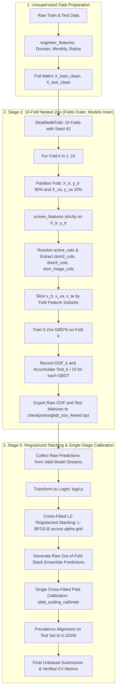

# Design Document: Leak-Free Cross-Validation, Resilient Caching, and Calibration Pipeline

**Date**: 2026-09-29  
**Status**: Approved by User  
**Scope**: P0 Foundation (Stage 2 GBDT Zoo & Stage 5 Meta-Stacker Leakage Fixes)

---

## 1. Context & Motivation

The modeling pipeline in `Chrisolande/liquidity` exhibited strong local cross-validation (CV) scores that failed to generalize to competition evaluation benchmarks. A deep audit revealed three primary structural bugs and sources of data leakage:

1. **Validation Fold Target Leakage in Feature Selection**: In `src/stages/stage2_gbdt_zoo.py`, feature screening was executed once globally across all 40,000 samples before splitting into cross-validation folds. The supervised screener observed target labels belonging to future validation splits, contaminating the validation metric.
2. **GBDT Fold Cache Bug & Incomplete Metadata**: In `src/stages/stage2_gbdt_zoo.py`, `active_cat_cols` was defined only within a conditional cache-miss branch. On subsequent architecture executions, `active_cat_cols` was uninitialized or carried stale state, causing crashes or silent column misalignment.
3. **In-Sample Evaluation in Calibration**: `blend_and_calibrate()` in `src/ensemble/stacking.py` fitted Platt scaling on the full out-of-fold prediction vector and evaluated predictions on the identical samples used for fitting.
4. **Greedy OOF Hill-Climbing**: Stage 5 optimized model combination weights via discrete forward hill-climbing directly against the out-of-fold validation labels, cherry-picking noise and reporting over-optimistic composite scores.

This document outlines the architecture, data flow, component design, and verification plan to make the cross-validation and ensembling pipelines strictly leak-free and mathematically sound.

---

## 2. Goals & Non-Goals

### Goals
- **Eliminate Target Leakage**: Ensure supervised feature screening occurs strictly within each outer fold's training split.
- **Resilient Fold Processing**: Reorganize the fold loop so all 5 zoo architectures train sequentially on each fold's cleanly prepared data, guaranteeing active categorical metadata is always valid.
- **Strictly Cross-Fitted Calibration**: Delegate calibration in `blend_and_calibrate()` to `platt_scaling_calibrate()` so every evaluated probability is genuinely out-of-sample.
- **Streamlined Stacking in Stage 5**: Replace in-sample greedy hill climbing with cross-fitted $L_2$-regularized logit stacking, followed by single-stage cross-fitted calibration.
- **Comprehensive Verification**: Implement automated invariance tests confirming zero leakage and zero metadata errors.

### Non-Goals
- Modifying underlying tree hyperparameter spaces or re-tuning base models in this phase.
- Adding new feature engineering algorithms (unsupervised engineering in `engineer_features()` remains unchanged).
- Redesigning Stage 3 (TabPFN) or Stage 4 (Distillation) until the Stage 2 and Stage 5 leak-free foundations are verified.

---

## 3. Architecture & Data Flow



---

## 4. Component Specifications

### 4.1. Stage 2 GBDT Zoo (`src/stages/stage2_gbdt_zoo.py`)

#### Inverted Execution Loop
The execution flow is updated from `Architectures (outer) -> Folds (inner)` to `Seeds (outer) -> Folds (outer) -> Architectures (inner)`:

```python
zoo_oof = {name: np.zeros(len(train_raw), dtype=float) for name, _, _, _ in architectures_def}
zoo_test = {name: np.zeros(len(test_raw), dtype=float) for name, _, _, _ in architectures_def}

for seed_val in seeds:
    skf = StratifiedKFold(n_splits=n_splits, shuffle=True, random_state=seed_val)
    
    for fold, (trn_idx, val_idx) in enumerate(skf.split(X_train_clean, y_true), start=1):
        x_tr_raw = X_train_clean.iloc[trn_idx]
        y_tr = y_true[trn_idx]
        x_va_raw = X_train_clean.iloc[val_idx]
        y_va = y_true[val_idx]
        x_te_raw = X_test_clean

        # Nested feature selection strictly on training partition
        selected_cols = screen_features(
            x_tr_raw, y_tr, cat_cols=cat_cols, k_top=k_top_features, seed=seed_val
        )
        
        # Explicit per-fold metadata resolution
        active_cats = [c for c in cat_cols if c in selected_cols]
        dom2_cols, dom3_cols, dom_triage_cols = extract_domain_feature_subsets(selected_cols)

        # Slice data for this fold
        x_tr = x_tr_raw[selected_cols].copy()
        x_va = x_va_raw[selected_cols].copy()
        x_te = x_te_raw[selected_cols].copy()

        for name, cls_, params, cols_fn in architectures_def:
            arch_cols = cols_fn(dom2_cols, dom3_cols, dom_triage_cols, selected_cols)
            arch_cats = [c for c in active_cats if c in arch_cols]

            val_p, test_p = train_single_model_fold(
                model_name=name,
                cls_=cls_,
                params=params,
                cols=arch_cols,
                cat_cols=arch_cats,
                x_tr=x_tr,
                y_tr=y_tr,
                x_va=x_va,
                y_va=y_va,
                x_te=x_te,
                seed=seed_val + fold,
            )
            zoo_oof[name][val_idx] += val_p / len(seeds)
            zoo_test[name] += test_p / (n_splits * len(seeds))
```

#### Saving Raw Deliverables
Stage 2 will continue to compute and display a calibrated score for local logging, but exports **raw out-of-fold probabilities** to `gbdt_zoo_4seed.npz` and `gbdt_balanced_dom1_p2_seeds4.npz` to prevent calibration compounding downstream.

---

### 4.2. Stacking & Calibration Module (`src/ensemble/stacking.py`)

#### Fixing `blend_and_calibrate()`
Lines 71–79 of `src/ensemble/stacking.py` previously fit `LogisticRegression` on `(z_oof, y_true)` and evaluated on the same `z_oof`. This is replaced with delegation to `platt_scaling_calibrate()`:

```python
from src.ensemble.calibration import platt_scaling_calibrate

def blend_and_calibrate(
    oof_dict: Dict[str, np.ndarray],
    test_dict: Dict[str, np.ndarray],
    y_true: np.ndarray,
    n_splits: int = 5,
    lam: float = 1e-3,
    seed: int = 42,
) -> Tuple[Dict[str, float], np.ndarray, np.ndarray, np.ndarray, np.ndarray]:
    # 1. Weight solving with cross-fitting
    ... # Existing cross-fitted solve_weights logic preserved
    
    # 2. Cross-fitted Platt scaling (replacing in-sample fit)
    oof_cal, test_cal, _ = platt_scaling_calibrate(
        oof_prob=oof_blend,
        test_prob=test_blend,
        y_true=y_true,
        n_splits=n_splits,
        seed=seed,
    )
    return weight_map, oof_blend, test_blend, oof_cal, test_cal
```

---

### 4.3. Stage 5 Meta-Stacker (`src/stages/stage5_meta_stacker.py`)

1. **Cross-Fitted $L_2$ Logit Stacking**:
   Stacking weights are optimized over logit-transformed raw probabilities using cross-fitted `L-BFGS-B` across regularization parameters $\alpha \in [10^{-6}, 5 \cdot 10^{-3}]$.
2. **Quarantine In-Sample Hill Climbing**:
   The unconstrained forward search `hill_climb_blend(pd.DataFrame(hc_candidates), ..., y_true)` is removed to stop overfitting on the OOF validation split.
3. **Single Cross-Fitted Calibration**:
   Apply `platt_scaling_calibrate()` on the chosen logit stack predictions before prevalence alignment and submission generation.

---

## 5. Verification & Testing Plan

### 5.1. Target Leakage Invariance Test
- **File**: `tests/test_leakage_invariance.py`
- **Methodology**:
  - Run fold 1 with ground truth `y_va`.
  - Invert validation labels `y_va_fake = 1 - y_va` and re-run fold 1.
  - Assert that `selected_cols` returned by `screen_features(x_tr_raw, y_tr)` is bit-for-bit identical regardless of `y_va`.
  - Assert that test predictions generated by fold 1 are bit-for-bit identical.

### 5.2. Cross-Fitted Calibration Unit Test
- **File**: `tests/test_calibration_crossfit.py`
- **Methodology**:
  - Feed mock probability predictions and targets to `blend_and_calibrate()`.
  - Verify that the returned `oof_cal` contains no in-sample prediction evaluation.
  - Verify that test predictions have appropriate shape and bounded probability outputs $[0.002, 0.998]$.

### 5.3. Stage 2 Multi-Architecture Integration Test
- **File**: `tests/test_stage2_smoke.py`
- **Methodology**:
  - Execute a 2-fold lightweight dry run of `stage2_gbdt_zoo.py` using synthetic/subset tabular data.
  - Verify all 5 architectures complete with no `KeyError` or missing column exceptions.
  - Confirm `gbdt_zoo_4seed.npz` is generated with valid raw OOF predictions.

---

## 6. Self-Review Checklist

- [x] **Placeholder Scan**: No TODOs, TBDs, or vague descriptions.
- [x] **Internal Consistency**: Data structures, function signatures, and file paths align across all sections.
- [x] **Scope Check**: Focuses squarely on P0 leakage and calibration fixes without expanding into speculative model tuning.
- [x] **Ambiguity Check**: Specific algorithms (`screen_features`, `L-BFGS-B`, `platt_scaling_calibrate`) and exact file locations are specified.
