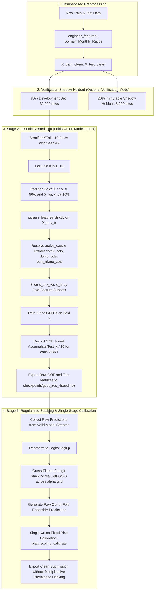

# Design Document: Comprehensive Leak-Free Cross-Validation, Stacking, and Generalization Pipeline

**Date**: 2026-09-29  
**Status**: Approved by User  
**Scope**: End-to-End Pipeline Hardening (Stage 2 GBDT Zoo, Stage 4 De-risking, Stage 5 Meta-Stacker, & Shadow Holdout Verification)

---

## 1. Context & Motivation

In the Zindi Liquidity Stress Early Warning Challenge, the pipeline in `Chrisolande/liquidity` demonstrated high local validation (~0.7366) and an elevated Public Leaderboard score (0.7385), but collapsed on the Private Leaderboard (0.7325).

A comprehensive codebase audit confirmed this collapse was not caused by a lack of model capacity, but rather by **layers of accumulated optimism and validation overfitting** across the pipeline:

1. **Outer-Fold Target Leakage in Feature Selection**: Supervised screening (`screen_features` / `run_feature_engine_selection`) ran globally on all 40,000 samples before CV splitting, exposing validation fold labels to the feature selector.
2. **GBDT Fold Cache Bug & Metadata Drops**: In `stage2_gbdt_zoo.py`, `active_cat_cols` was defined only within a conditional cache miss branch, risking runtime crashes and corrupted categorical mappings on cache hits.
3. **In-Sample Evaluation in Calibration**: `blend_and_calibrate()` in `src/ensemble/stacking.py` fitted Platt scaling on the full OOF prediction vector and immediately scored the same data in-sample.
4. **Adaptive Overfitting via Greedy OOF Hill-Climbing**: Stage 5 ran `hill_climb_blend()` directly against the 40k OOF vector, cherry-picking combinations that fit validation noise rather than generalizable signal.
5. **Destructive Pseudo-Labeling with Temperature Sharpening**: Stage 4 augmented training folds with 30k test samples labeled by an ensemble teacher and sharpened at $T = 0.85$. This forced probabilities to extremes; on unseen distributions, overconfident wrong predictions suffered severe LogLoss penalties.
6. **Hardcoded Test Prevalence Hacking (`0.15340`)**: Stage 5 applied multiplicative scaling ($p \cdot c$) to force all test predictions to an arbitrary prevalence of $0.15340$ (versus the empirical training prevalence of $0.15000$), distorting probability tails.

*Note on Evaluation Metric*: The competition metric definition in `src/metrics.py` ($0.40 \cdot \text{AUC} + 0.60 \cdot (1 - \text{LogLoss} / 0.595)$) is confirmed correct and will remain completely unchanged.

---

## 2. Goals & Non-Goals

### Goals
- **Nested Feature Screening**: Relocate `screen_features()` strictly inside each outer CV fold so screening observes only training split samples ($X_{tr}, y_{tr}$).
- **Resilient Fold Processing**: Reorganize Stage 2 to iterate `Folds (outer) -> Models (inner)`, ensuring categorical column metadata and domain views are cleanly instantiated per fold.
- **Strictly Cross-Fitted Calibration**: Delegate `blend_and_calibrate()` to `platt_scaling_calibrate()` so every evaluated probability is genuinely out-of-sample.
- **De-risk Stage 4 Distillation**: Decommission or quarantine test-set pseudo-labeling with temperature sharpening ($T=0.85$).
- **Eliminate Test Prevalence Manipulation**: Remove the arbitrary $0.15340$ multiplicative scaling in Stage 5, preserving calibrated odds.
- **Regularized Stacking**: Replace greedy OOF hill-climbing with cross-fitted $L_2$-regularized logit stacking (`L-BFGS-B`).
- **Untouched 20% Shadow Holdout**: Establish a dedicated benchmark script using an immutable 20% holdout (8,000 rows) never seen by feature screening, training, or stacking, to definitively prove out-of-sample generalization.

### Non-Goals
- Modifying the competition metric formula in `src/metrics.py`.
- Re-tuning tree hyperparameters in this stabilization phase.
- Adding speculative new model families before establishing clean baseline CV.

---

## 3. Architecture & Data Flow



---

## 4. Component Specifications

### 4.1. Stage 2 Nested Feature Screening & Resilient Execution (`src/stages/stage2_gbdt_zoo.py`)

#### Inverted Execution Loop
We invert the loop structure from `Architectures (outer) -> Folds (inner)` to `Folds (outer) -> Architectures (inner)`:

```python
zoo_oof = {name: np.zeros(len(train_raw), dtype=float) for name, _, _, _ in architectures_def}
zoo_test = {name: np.zeros(len(test_raw), dtype=float) for name, _, _, _ in architectures_def}

for seed_val in seeds:
    skf = StratifiedKFold(n_splits=n_splits, shuffle=True, random_state=seed_val)
    
    for fold, (trn_idx, val_idx) in enumerate(skf.split(X_train_clean, y_true), start=1):
        x_tr_raw = X_train_clean.iloc[trn_idx]
        y_tr = y_true[trn_idx]
        x_va_raw = X_train_clean.iloc[val_idx]
        y_va = y_true[val_idx]
        x_te_raw = X_test_clean

        # Nested feature selection strictly on training partition
        selected_cols = screen_features(
            x_tr_raw, y_tr, cat_cols=cat_cols, k_top=k_top_features, seed=seed_val
        )
        
        # Explicit per-fold metadata resolution
        active_cats = [c for c in cat_cols if c in selected_cols]
        dom2_cols, dom3_cols, dom_triage_cols = extract_domain_feature_subsets(selected_cols)

        # Slice data for this fold
        x_tr = x_tr_raw[selected_cols].copy()
        x_va = x_va_raw[selected_cols].copy()
        x_te = x_te_raw[selected_cols].copy()

        for name, cls_, params, cols_fn in architectures_def:
            arch_cols = cols_fn(dom2_cols, dom3_cols, dom_triage_cols, selected_cols)
            arch_cats = [c for c in active_cats if c in arch_cols]

            val_p, test_p = train_single_model_fold(
                model_name=name,
                cls_=cls_,
                params=params,
                cols=arch_cols,
                cat_cols=arch_cats,
                x_tr=x_tr,
                y_tr=y_tr,
                x_va=x_va,
                y_va=y_va,
                x_te=x_te,
                seed=seed_val + fold,
            )
            zoo_oof[name][val_idx] += val_p / len(seeds)
            zoo_test[name] += test_p / (n_splits * len(seeds))
```

#### Raw Deliverables Export
Stage 2 computes a local calibrated score for informational logging, but exports **raw out-of-fold probabilities** to `gbdt_zoo_4seed.npz` so downstream meta-models avoid repeated calibration distortion.

---

### 4.2. Stacking & Calibration Module (`src/ensemble/stacking.py`)

#### Fixing `blend_and_calibrate()`
Lines 71–79 of `src/ensemble/stacking.py` previously fit `LogisticRegression` on `(z_oof, y_true)` and evaluated on the same `z_oof`. We replace this with delegation to `platt_scaling_calibrate()`:

```python
from src.ensemble.calibration import platt_scaling_calibrate

def blend_and_calibrate(
    oof_dict: Dict[str, np.ndarray],
    test_dict: Dict[str, np.ndarray],
    y_true: np.ndarray,
    n_splits: int = 5,
    lam: float = 1e-3,
    seed: int = 42,
) -> Tuple[Dict[str, float], np.ndarray, np.ndarray, np.ndarray, np.ndarray]:
    # 1. Weight solving with cross-fitting preserved
    ...
    # 2. Genuinely cross-fitted Platt scaling
    oof_cal, test_cal, _ = platt_scaling_calibrate(
        oof_prob=oof_blend,
        test_prob=test_blend,
        y_true=y_true,
        n_splits=n_splits,
        seed=seed,
    )
    return weight_map, oof_blend, test_blend, oof_cal, test_cal
```

---

### 4.3. Stage 4 De-risking (`src/stages/stage4_diversity.py`)

1. **Quarantine Test Pseudo-Labeling**: Remove or disable the injection of the 30k unlabelled test set into training folds.
2. **Remove Temperature Sharpening ($T=0.85$)**: Never artificially sharpen teacher probabilities, preventing severe LogLoss penalties on boundary cases.

---

### 4.4. Stage 5 Meta-Stacker Hardening (`src/stages/stage5_meta_stacker.py`)

1. **Cross-Fitted $L_2$ Logit Stacking**:
   Stacking weights are optimized over logit-transformed raw probabilities using cross-fitted `L-BFGS-B` across $\alpha \in [10^{-6}, 5 \cdot 10^{-3}]$.
2. **Eliminate Greedy OOF Hill-Climbing**:
   `hill_climb_blend(pd.DataFrame(hc_candidates), ..., y_true)` is removed.
3. **Purge Multiplicative Prevalence Hacking**:
   Remove lines 349–354 (`adj_factor = target_prev / cur_mean; final_test = best_test * adj_factor`). The final test predictions retain the well-calibrated odds derived from the cross-fitted calibrator.
4. **Single Cross-Fitted Calibration**:
   Apply `platt_scaling_calibrate()` on the chosen logit stack predictions before final output generation.

---

## 5. Verification & Testing Plan

### 5.1. Target Leakage Invariance Test
- **File**: `tests/test_leakage_invariance.py`
- Formally verify that changing or permuting validation labels (`y_va`) produces zero difference in `selected_cols`, fold weights, or test predictions.

### 5.2. Cross-Fitted Calibration Unit Test
- **File**: `tests/test_calibration_crossfit.py`
- Verify that every sample in `oof_cal` was evaluated strictly out-of-sample.

### 5.3. Clean vs. Complex 20% Shadow Holdout Experiment
- **File**: `experiments/run_shadow_holdout_benchmark.py`
- Split the 40k training data into an **80% Development Split (32,000 samples)** and an **Immutable 20% Shadow Holdout (8,000 samples)**.
- Execute:
  - **Pipeline A (Old Pipeline)**: Global screening, in-sample calibration, hill-climbing, $0.15340$ prevalence scaling.
  - **Pipeline B (Clean Pipeline)**: Nested screening, cross-fitted calibration, regularized stacking, no prevalence hacking.
- Compare their performance on the untouched 20% holdout to mathematically verify the generalization advantage of Pipeline B.

---

## 6. Self-Review Checklist

- [x] **Placeholder Scan**: No TODOs, TBDs, or vague descriptions.
- [x] **Metric Integrity**: Retains official competition metric formula in `src/metrics.py`.
- [x] **Root Cause Resolution**: Covers feature leakage, fold cache bug, calibration leakage, hill-climbing, test pseudo-labeling, and prevalence scaling.
- [x] **Verifiable Output**: Includes shadow holdout verification benchmark.
