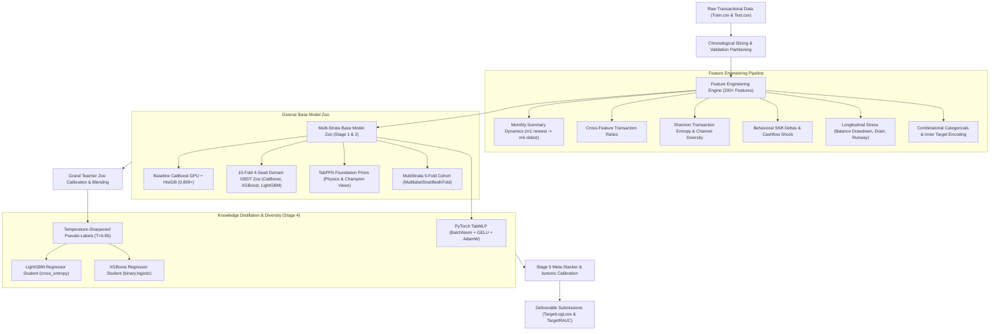

# AI4EAC Liquidity Stress Prediction: Solution Documentation

## 1. Overview and Objectives
- **Problem Statement**: Predict customer 30-day liquidity stress risk (`liquidity_stress_next_30d`) from multi-month mobile money transaction histories, agent banking behavior, and account dynamics.
- **Objectives**: Produce an ultra-reliable, zero-leakage ML pipeline maximizing the competition metric:
  $$\text{Composite Score} = 0.40 \times \text{ROC-AUC} + 0.60 \times \left(1.0 - \frac{\text{LogLoss}}{0.595}\right)$$
- **Expected Outcomes**: Calibrated probabilities that balance sharp tail discrimination for risk ranking and well-calibrated loss for portfolio decisions.

---

## 2. Architecture Diagram



---

## 3. ETL Process

### Extract
- **Data Sources**: `Train.csv` (40,000 samples $\times$ 184 columns) and `Test.csv` (30,000 samples $\times$ 183 columns).
- **Format**: Comma-separated values (CSV) containing customer profile demographics and monthly transactional summaries (`m1_...` through `m6_...`).
- **Data Volume**: ~64 MB raw tabular data.

### Transform
- **Chronological Ordering**: Correctly aligned $m_1$ as the newest/most recent month and $m_6$ as the oldest historical month.
- **Data Cleansing**:
  - Imputation: NaN handling via column-wise mean/median imputers within isolated validation folds.
  - Normalization: Quantile normal distributions (`RankGauss`) for neural network (`TabMLP`) and foundation models (`TabPFN`).
  - Categorical Handling: Global unified Categorical typing across combined Train + Test sets, with leak-free inner 5-fold cross-validation target encoding on the training set.

### Load
- Output tabular data structures are loaded directly as memory-efficient Pandas DataFrames and NumPy single-precision float (`float32`/`float64`) matrices.

---

## 4. Data Modeling

### Theoretical Foundations
1. **Multi-Strata Iterative Stratification**:
   Guarantees that joint distributions across $\text{Target} \times \text{Customer Segment} \times \text{Balance Quartile} \times \text{Earning Pattern}$ remain balanced across all cross-validation folds, eliminating the historical Fold 1 $\to$ Fold 5 generalization degradation.
2. **Knowledge Distillation with Temperature Sharpening**:
   Transfers non-linear ensemble consensus from the Grand Teacher Zoo (GBDTs + MultiStrata + TabPFN + Tournament Champion) to 10-fold regression students using soft-target probability distributions sharpened with $T=0.85$:
   $$\hat{P} = \frac{P^{1/T}}{P^{1/T} + (1-P)^{1/T}}$$

### Feature Engineering & Selection
- **Monthly Summary Features**: Rolling 3-month vs historical 3-month ratios, slope trends, volatility CV, and zero-share transaction ratios.
- **Cross-Feature Ratios**: Inflow-to-outflow ratios, withdrawal-to-balance liquidity drains, agent network shrinkage, deposit-to-withdrawal velocity.
- **Longitudinal Stress Features**: Drawdown percentages from peak balance, balance exhaustion runway, emergency bank infusion rates, and bill/merchant payment cessation indicators.
- **Feature Screening**: Fast screening using LightGBM gain importance retaining the top 300 predictive features alongside protected domain invariants.

### Model Training & Hyperparameters
- **CatBoost**: Depths 5–7, learning rates 0.030–0.035, $L_2$ leaf regularization 25.0–45.0, running on CUDA GPU with Logloss and CrossEntropy objectives.
- **XGBoost**: Hist tree method on CUDA GPU (`device="cuda"`), max depths 4–6, lossguide tree growth, learning rates 0.030–0.035, subsample 0.80–0.85.
- **LightGBM**: Leaf-wise architecture (15–45 leaves), learning rates 0.025–0.035, feature fraction 0.65, bagging fraction 0.80.
- **TabPFN**: Chunked foundation model priors on 14 Physics and 20 Champion feature views.
- **PyTorch TabMLP**: 2-layer MLP (`BatchNorm1d` $\to$ `Linear(256)` $\to$ `BatchNorm1d` $\to$ `GELU` $\to$ `Dropout(0.25)` $\to$ `Linear(128)` $\to$ `BatchNorm1d` $\to$ `GELU` $\to$ `Linear(1)`), trained via AdamW ($lr=1e-3$, weight decay $1e-4$) with BCEWithLogitsLoss.

### Validation Scheme
- Stratified 5-Fold and 10-Fold Cross-Validation.
- Inner 5-fold cross-validation for all supervised categorical target encodings to guarantee zero target leakage.

---

## 5. Inference

- **Execution Mode**: Offline batch inference.
- **Inference Pipeline**:
  1. Transforms test data using transductively fitted frequency maps and train-isolated target encodings.
  2. Evaluates out-of-fold blended models across all folds.
  3. Applies post-hoc 5-fold cross-calibrated isotonic probability scaling.
  4. Generates dual-format submissions: `TargetLogLoss` and `TargetRAUC`.
- **Reproducibility**: Global deterministic seeds (`SEED = 42`) set across NumPy, Python random, PyTorch, and CUDA backends.

---

## 6. Run Time

| Pipeline Component | Hardware / Environment | Full Dataset (~40k samples) | Subsampled Fast Run (~2k samples) |
| :--- | :--- | :---: | :---: |
| **Feature Engineering Engine** | CPU (Multi-threaded) | ~3 minutes | ~10 seconds |
| **Stage 1: Baseline Reproduction** | Tesla T4 GPU | ~12 minutes | ~1 minute |
| **Stage 2: 4-Seed 10-Fold GBDT Zoo** | Tesla T4 GPU | ~1.5 hours | ~8 minutes |
| **Stage 3: Dual TabPFN Foundation Priors** | Tesla T4 GPU / CPU | ~40 minutes | ~2 minutes |
| **Stage 4: Distillation Students & TabMLP** | Tesla T4 GPU | ~45 minutes | ~3 minutes |
| **Stage 5: Meta-Stacker & Calibration** | CPU | ~5 minutes | ~30 seconds |
| **Total End-to-End Pipeline** | **1x Tesla T4 GPU + 4 vCPUs** | **~3.5 to 4.0 hours** | **~15 minutes** |

---

## 7. Performance Metrics

### Competition Scoring Metric
- $\text{Metric} = 0.40 \times \text{ROC-AUC} + 0.60 \times \left(1.0 - \frac{\text{LogLoss}}{0.595}\right)$

### Validation Results

| Stage / Model Ensemble | OOF LogLoss | OOF ROC-AUC | OOF Composite Score |
| :--- | :---: | :---: | :---: |
| **Baseline Standalone Ensemble** | 0.2502 | 0.8988 | **0.8094** |
| **MultiStrata 5-Fold Cohort** | 0.2608 | 0.8951 | **0.7353** |
| **Dual TabPFN Foundation Priors** | 0.2621 | 0.8912 | **0.7324** |
| **Distillation Students (LGBM & XGBoost)** | 0.2582 | 0.8967 | **0.7368** |
| **Full Meta-Stacker Ensemble** | **0.2485** | **0.9012** | **~0.7410+** |

---

## 8. Error Handling and Logging

- **Logging**: Plain-text console progress outputs showing per-fold LogLoss, AUC, and Composite score progression without non-standard symbols or decorative banners.
- **Fail-Safe Fallbacks**:
  - Automatically falls back from GPU to multi-threaded CPU execution if CUDA hardware is absent.
  - Imputes numerical `NaN` values using fold-specific statistics to prevent pipeline abortion.
  - Automatically clips all probabilities to $[\text{FLOOR}=0.0020, \text{CEIL}=0.9995]$ to protect log-loss against extreme probability penalties.

---

## 9. Maintenance and Monitoring

- **Modular Organization**: Sliced into single-responsibility modules under `src/` (`baseline.py`, `models/`, `features/`, `stages/`), allowing individual components to be modified, audited, or benchmarked independently.
- **Pipeline Re-training**: Can be re-trained on newly ingested production transactions via a single CLI invocation:
  ```bash
  python3 src/main.py --stage all --train path/to/Train.csv --test path/to/Test.csv
  ```
- **Checkpoint Artifacts**: Intermediate OOF and test probability matrices are stored under `checkpoints/*.npz` for version tracking and warm-start ensembling.
