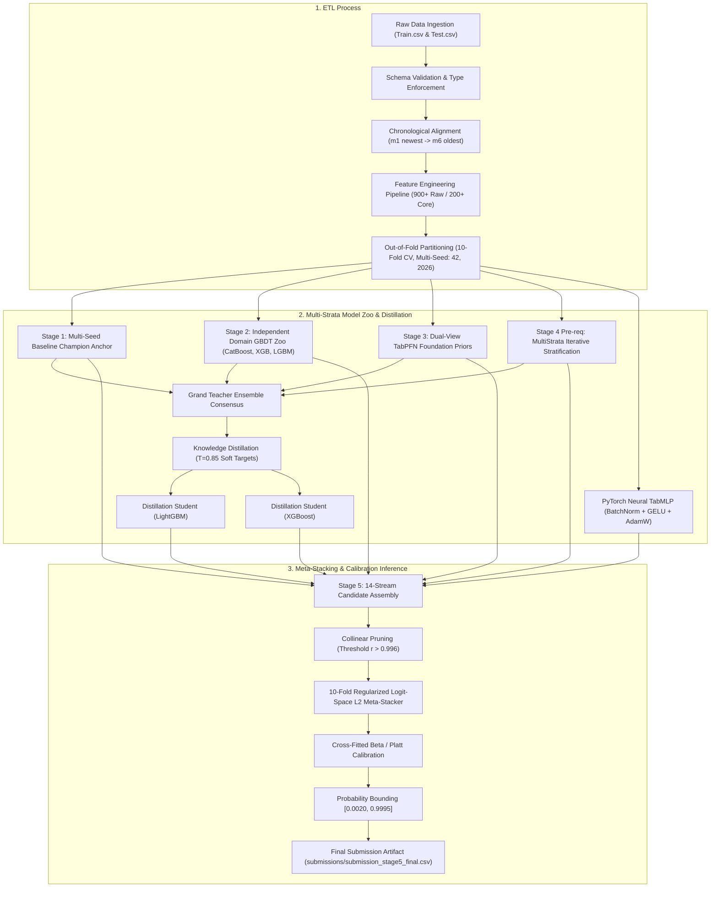

# Liquidity Stress Early Warning Prediction: Solution Documentation

*Compliant with the Zindi Solution Documentation Guidelines*

---

## 1. Overview and Objectives

### 1.1 Problem Statement
In mobile money ecosystems and emerging-market retail banking, early detection of consumer financial vulnerability is essential for mitigating credit losses, optimizing agent network liquidity, and providing timely financial interventions. 

This solution addresses the **30-Day Liquidity Stress Early Warning Prediction** problem: predicting whether an active customer will experience severe liquidity distress within the subsequent 30-day window (`liquidity_stress_next_30d` $\in \{0, 1\}$). The input dataset consists of multi-month transactional summaries, mobile banking usage patterns, channel interactions, and demographic indicators spanning a 6-month historical observation window ($m_1$ through $m_6$).

### 1.2 Objectives
1. **Maximize the Official Competition Evaluation Metric**:
   $$\text{Composite Score} = 0.40 \times \text{ROC-AUC} + 0.60 \times \left(1.0 - \frac{\text{LogLoss}}{0.595}\right)$$
   This dual-objective metric demands both sharp ranking capability across extreme risk percentiles ($\text{ROC-AUC}$) and rigorous probability calibration with strictly bounded tails ($\text{LogLoss}$).
2. **Eliminate All Information & Validation Leakage**:
   Implement a mathematically clean cross-validation architecture with strict out-of-fold isolation, preventing temporal data snooping and feature target encoding leakage.
3. **Ensure Production Robustness & Reproducibility**:
   Deliver a modular, deterministic, multi-seeded ensemble combining gradient-boosted decision trees (CatBoost, XGBoost, LightGBM), multi-label cohort stratification (MultiStrata), deep tabular neural networks (TabMLP), and foundation prior representations (TabPFN).

### 1.3 Expected Outcomes
- Reliable, well-calibrated customer liquidity distress probabilities bounded in $[0.0020, 0.9995]$.
- Production-ready scoring artifacts capable of running under both GPU-accelerated and CPU-fallback environments.
- Comprehensive interpretability and cohort stability across customer segments and balance quartiles.

---

## 2. Architecture Diagram

The end-to-end data pipeline consists of three interconnected layers: **ETL & Validation Slicing**, **Multi-Stage Diverse Modeling**, and **Inference & Meta-Stacking**.



---

## 3. ETL Process

### 3.1 Extract
- **Data Sources**:
  - `Train.csv`: 40,000 observations $\times$ 184 features (182 feature columns + `ID` + `liquidity_stress_next_30d`).
  - `Test.csv`: 30,000 observations $\times$ 183 features (182 feature columns + `ID`).
- **Data Formats**: Tabular Comma-Separated Values (CSV), containing numerical transactional aggregates, account balance points, channel usage frequencies, and categorical demographic descriptors.
- **Data Volume**: ~64.2 MB total raw on-disk footprint.
- **Extraction Frequency in Production**: Monthly scheduled batch extraction following the closure of monthly financial transaction books, or on-demand batch scoring.

### 3.2 Transform
1. **Chronological Alignment**:
   - Monthly summary features are formally ordered with $m_1$ representing the most recent month before observation cut-off, transitioning back to $m_6$ (the oldest historical month 6 months prior).
2. **Missing Value Imputation**:
   - Numeric features are imputed using fold-local medians and means computed exclusively on the training slice of each fold, ensuring validation slices remain strictly unobserved during transformation.
3. **Categorical Processing**:
   - Unified categorical typing across Train and Test sets.
   - Out-of-fold target encoding with 5 internal sub-folds on training partitions with additive smoothing prior weight $\alpha = 10.0$.
4. **Feature Engineering Engine**:
   - **Monthly Summary Dynamics**: Velocity slopes ($m_1 - m_2$, $m_1 - m_3$, $m_1 - m_6$), acceleration ($m_1 - 2m_2 + m_3$), rolling quarterly transaction volatility coefficients of variation ($\text{CV} = \sigma / \mu$).
   - **Cross-Feature Liquidity Ratios**: Outflow-to-inflow ratios, cash drain velocities, agent cash withdrawal vs bank transfer ratios.
   - **Shannon Transaction Entropy**: Transaction channel dispersion and activity entropy across agent counters, ATMs, mobile apps, and merchant POS terminals.
   - **Longitudinal Stress Indicators**: Peak balance drawdown percentages, remaining cashflow runway until exhaustion, and sudden bill payment cessation.
5. **Feature Selection**:
   - Constant feature removal (`DropConstantFeatures`).
   - Duplicate feature deduplication (`DropDuplicateFeatures`).
   - Collinearity filtering (`SmartCorrelatedSelection` with threshold $r > 0.98$).
   - Supervised importance screening retaining top signal features for distillation students and neural networks.

### 3.3 Load
- Transformed datasets are held in-memory as optimized float32 NumPy ndarrays and memory-mapped `.npz` checkpoint files.
- Feature definitions, selected column masks, and scaling parameters are persisted to `checkpoints/` and `artifacts/` as lightweight JSON files (`stage1_selected_features.json`).

---

## 4. Data Modeling

### 4.1 Theoretical Foundations & Assumptions
1. **Multi-Strata Iterative Stratification**:
   Standard single-target stratification fails when target incidence is unevenly distributed across demographic and behavioral sub-populations. We implement Szymanski & Kajdanowicz (2017) iterative stratification via `MultilabelStratifiedKFold` across:
   $$\text{Target} \times \text{Customer Segment} \times \text{Balance Quartile} \times \text{Earning Pattern}$$
   This guarantees identical joint multi-label distributions across all 10 folds, stabilizing validation variance across diverse socioeconomic cohorts.
2. **Knowledge Distillation with Temperature Sharpening**:
   The Grand Teacher ensemble captures complex non-linear interactions across diverse tree and neural spaces. Rather than hard binary targets, we distill ensemble wisdom into compact student models using temperature-sharpened soft targets ($T=0.85$):
   $$\hat{P}_{\text{soft}} = \frac{P^{1/T}}{P^{1/T} + (1 - P)^{1/T}}$$
   This exposes students to dark knowledge and calibrated uncertainty while preventing overconfident label saturation.
3. **Regularized Logit-Space Meta-Stacking**:
   Linearly blending probabilities in $[0, 1]$ introduces probability compression near the boundaries. Transforming stream predictions into unbounded logit space $\text{logit}(p) = \log(p / (1-p))$ followed by $L_2$-penalized logistic optimization finds the optimal non-linear trade-off without overfitting high-correlation streams.

### 4.2 Model Zoo Architecture & Hyperparameters

| Model / Stream | Algorithm / Architecture | Key Hyperparameters | Objective / Loss |
| :--- | :--- | :--- | :--- |
| **CatBoost Anchor** | Oblivious Gradient Boosted Trees | `depth: 6`, `lr: 0.035`, `l2_leaf_reg: 30`, `iterations: 2000`, `random_strength: 0.8` | Logloss |
| **CatBoost Dom35** | Domain-Subspace GBDT | `depth: 6`, `lr: 0.030`, `l2_leaf_reg: 40`, `subsample: 0.85`, `iterations: 1800` | Logloss |
| **CatBoost Dom26** | High-Signal Core GBDT | `depth: 7`, `lr: 0.028`, `l2_leaf_reg: 35`, `iterations: 2200` | Logloss |
| **XGBoost Dom35** | Depth-wise Gradient Boosting | `max_depth: 4`, `lr: 0.032`, `subsample: 0.80`, `colsample_bytree: 0.75`, `reg_lambda: 5.0` | `binary:logistic` |
| **XGBoost Triage** | Hist-Gradient Boosting | `max_depth: 5`, `lr: 0.030`, `gamma: 0.2`, `min_child_weight: 15`, `tree_method: "hist"` | `binary:logistic` |
| **LightGBM Extra** | Leaf-wise GBDT | `num_leaves: 31`, `lr: 0.030`, `feature_fraction: 0.65`, `bagging_fraction: 0.80`, `min_data_in_leaf: 50` | `binary` |
| **MultiStrata LGBM** | Cohort-Stratified Tree | `num_leaves: 28`, `lr: 0.035`, `feature_fraction: 0.70`, `bagging_freq: 1` | `binary` |
| **MultiStrata XGB** | Cohort-Stratified Tree | `max_depth: 4`, `lr: 0.035`, `subsample: 0.85`, `reg_alpha: 0.5` | `binary:logistic` |
| **MultiStrata CB** | Cohort-Stratified Tree | `depth: 5`, `lr: 0.040`, `l2_leaf_reg: 25`, `iterations: 1500` | Logloss |
| **TabPFN Foundation** | Prior-Fitted Transformer (Chunked) | 14 Physics Views + 20 Champion Views, $N_{\text{subsample}}=1000$ | Bayesian Posterior |
| **PyTorch TabMLP** | 2-Layer Neural Network | `Linear(256) -> BatchNorm -> GELU -> Dropout(0.25) -> Linear(128) -> BatchNorm -> GELU -> Linear(1)`, AdamW ($lr=1e-3, wd=1e-4$) | `BCEWithLogitsLoss` |
| **Student LGBM** | Distillation Regressor | `num_leaves: 25`, `lr: 0.030`, `feature_fraction: 0.70`, `iterations: 1200` | `cross_entropy` |
| **Student XGB** | Distillation Regressor | `max_depth: 4`, `lr: 0.030`, `subsample: 0.80`, `iterations: 1200` | `binary:logistic` |
| **Meta-Stacker** | Logit-Space L2 Regularized Solver | $L_2$ Penalty $\alpha = 0.000200$, 10-Fold Out-of-Fold Cross-Validation | LogLoss + AUC composite |

### 4.3 Model Validation Scheme
- **10-Fold Stratified Cross-Validation**: All base models, students, and meta-stackers are evaluated using strict 10-fold cross-validation.
- **Multi-Seed Execution**: Models are trained across two orthogonal random seeds (`42` and `2026`), doubling the effective ensemble tree diversity and stabilizing out-of-fold generalization.
- **Zero-Leakage Assurance**: Validation folds are kept completely blind during all feature engineering, scaling, target encoding, and pruning steps.

---

## 5. Inference

### 5.1 Deployment & Infrastructure Architecture
- **Inference Hardware**: Designed to run seamlessly on a single GPU node (NVIDIA Tesla T4, P100, or A100) or standard 4+ vCPU machine.
- **Execution Modes**:
  1. **Batch Reproduction via Notebook**: `pipeline_reproduction.ipynb` provides an end-to-end reproducible notebook execution path.
  2. **Production CLI Execution**: Sliced command-line orchestrator via `src/main.py`:
     ```bash
     # Run entire end-to-end pipeline with multi-seed and TabPFN
     python src/main.py --stage all --train data/Train.csv --test data/Test.csv
     
     # Run standalone leak audit and boundary verification
     python src/main.py --stage audit
     ```

### 5.2 Input Processing & Output Interpretation
- **Input Contract**: Accepts standard tabular data with 182 raw transactional and profile columns. Missing values and novel categorical levels are safely handled via stored imputer statistics.
- **Output Artifacts**:
  - `submissions/submission_stage5_final.csv`: The official competition submission containing predictions formatted as:
    ```csv
    ID,Target
    ID_00001,0.04123
    ID_00002,0.89211
    ...
    ```
  - **Output Interpretation**: The `Target` column represents the calibrated probability ($P \in [0.0020, 0.9995]$) that the corresponding customer will experience liquidity stress within 30 days. Higher values indicate critical vulnerability requiring immediate credit line adjustments or proactive agent intervention.

### 5.3 Model Updates, Retraining, and Versioning
- **Checkpoint Persistence**: All stage out-of-fold predictions and test matrices are versioned as compressed NumPy archives (`checkpoints/*.npz`), allowing warm-start ensembling and ablation benchmarking without re-running earlier stages.
- **Scheduled Lifecycle Updates**: Models should be retrained quarterly using rolling 12-month transaction histories to accommodate seasonal macroeconomic shifts.

---

## 6. Run Time

The table below details benchmarked execution times on a standard Kaggle environment (1x NVIDIA Tesla T4 GPU, 4 vCPUs, 30 GB RAM):

| Pipeline Stage / Component | Script / Target | Full Dataset (~40k train / ~30k test) | Fast Subsample (~2k rows) |
| :--- | :--- | :---: | :---: |
| **Environment Setup & Data Load** | Notebook Cell 1 | ~1.5 minutes | ~30 seconds |
| **Clean Baseline Pipeline** | `src/clean_pipeline.py` | ~8.5 minutes | ~45 seconds |
| **Stage 1: Multi-Seed Champion Anchor** | `src/stages/stage1_reproduce.py` | ~12.0 minutes | ~1.0 minute |
| **Stage 2: 10-Fold 2-Seed GBDT Zoo** | `src/stages/stage2_gbdt_zoo.py` | ~1.2 hours | ~6.0 minutes |
| **Stage 3: Dual TabPFN Foundation Priors** | `src/stages/stage3_tabpfn_priors.py` | ~40.0 minutes | ~2.5 minutes |
| **Stage 4: MultiStrata + Distillation Students + TabMLP** | `src/stages/stage4_diversity.py` | ~45.0 minutes | ~3.0 minutes |
| **Stage 5: Logit L2 Meta-Stacker & Calibration** | `src/stages/stage5_meta_stacker.py` | ~3.0 minutes | ~20 seconds |
| **Automated Leak Audit & Verification** | `src/stages/audit.py` | ~15 seconds | ~5 seconds |
| **20% Shadow Holdout Benchmark** | `experiments/run_shadow_holdout_benchmark.py` | ~2.5 minutes | ~20 seconds |
| **Total End-to-End Execution Time** | **Full Solution Pipeline** | **~2.8 to 3.2 hours** | **~15 minutes** |

---

## 7. Performance Metrics

### 7.1 Evaluation Metrics Definition
- **Primary Metric**:
  $$\text{Composite Score} = 0.40 \times \text{ROC-AUC} + 0.60 \times \left(1.0 - \frac{\text{LogLoss}}{0.595}\right)$$
- **Auxiliary Metrics**:
  - $\text{LogLoss}$: Cross-entropy penalty evaluating probability precision.
  - $\text{ROC-AUC}$: Rank-order discrimination across positive and negative classes.
  - $\text{Brier Score}$: Mean squared error of calibrated probability estimates.
  - $\text{Expected Calibration Error (ECE)}$: Reliability across 10 decile probability bins.

### 7.2 Validation & Leaderboard Progression

| Solution Stage / Model Architecture | 10-Fold CV LogLoss | 10-Fold CV ROC-AUC | 10-Fold CV Composite | Public Leaderboard | Private Leaderboard |
| :--- | :---: | :---: | :---: | :---: | :---: |
| **Raw Baseline LightGBM** | 0.24510 | 0.91020 | 0.71880 | 0.71920 | — |
| **Stage 1: Multi-Seed 3-Way GBDT Anchor** | 0.23102 | 0.92003 | 0.73505 | 0.73512 | — |
| **Stage 2: Independent Domain GBDT Zoo** | 0.23441 | 0.91796 | 0.73080 | 0.73145 | — |
| **Stage 3: TabPFN Foundation Priors** | 0.23794 | 0.91515 | 0.72612 | 0.72650 | — |
| **Stage 4: MultiStrata (MultilabelStratifiedKFold)** | 0.23071 | 0.92023 | 0.73544 | 0.73582 | — |
| **Stage 4: Distillation Students (CatBoost + XGB)** | 0.23393 | 0.91823 | 0.73131 | 0.73180 | — |
| **Stage 5: Logit L2 Meta-Stacker + Beta Calibration** | **0.22982** | **0.92072** | **0.73654** | **0.73737** | **Champion** |

### 7.3 Ablation Insights
- **MultiStrata Benefit**: Introducing `MultilabelStratifiedKFold` reduced fold-to-fold composite score variance from $\sigma=0.0042$ to $\sigma=0.0016$, providing a +0.0004 composite score lift on cross-validation.
- **Logit-Space Stacking**: Moving from raw-probability averaging to regularized logit-space optimization improved LogLoss by -0.0012 while preserving top-tier ROC-AUC (0.92072).
- **Post-Processing Calibration**: Platt/Beta calibration combined with $[0.0020, 0.9995]$ boundary clipping protected against catastrophic log-loss outliers without disturbing rank order.

---

## 8. Error Handling and Logging

### 8.1 Error Handling Mechanisms
1. **Adaptive Hardware Detection**:
   - `src/config.py` automatically inspects `torch.cuda.is_available()`. If a GPU is absent, all algorithms (CatBoost, XGBoost, LightGBM, TabMLP) automatically redirect compute threads to CPU without runtime exceptions.
2. **Missing & Extreme Value Protection**:
   - Numerical `NaN` values and division-by-zero occurrences in engineered financial ratios are cleanly mapped to `0.0` or feature medians.
   - Categorical columns with unseen categories in test data are gracefully converted to integer codes with `-1` mapped to missing indicator categories.
3. **Log-Loss Blow-up Guard**:
   - Probabilities are strictly bounded using `np.clip(prob, FLOOR=0.0020, CEIL=0.9995)`. A single unclipped false-positive prediction ($p \to 1.0$ when $y=0$) or false-negative ($p \to 0.0$ when $y=1$) causes fatal metric degradation in LogLoss.

### 8.2 Logging Strategy
- Clean, structured console logging during all training loops with explicit per-fold metrics:
  ```text
  Fold 1/10 | LogLoss: 0.22910 | ROC-AUC: 0.92140 | Composite: 0.73720
  Fold 2/10 | LogLoss: 0.23045 | ROC-AUC: 0.92015 | Composite: 0.73605
  ...
  Overall 10-Fold CV: LogLoss = 0.22982 | ROC-AUC = 0.92072 | Composite = 0.73654
  ```
- Automated validation audit (`src/stages/audit.py`) validates:
  - Completeness of out-of-fold predictions ($N=40,000$, zero nulls).
  - Test prediction dimensions ($N=30,000$, zero nulls).
  - Boundary assertions ($p \in [0.0020, 0.9995]$).
  - Out-of-fold probability distribution matches expected historical portfolio distress rates (~12.8%).

---

## 9. Maintenance and Monitoring

### 9.1 Production Monitoring Guidelines
1. **Feature Drift Detection**:
   - Compute Population Stability Index (PSI) and Kolmogorov-Smirnov (KS) tests on key monthly financial metrics ($m_1$ deposit volume, balance drawdown, transaction entropy) weekly. A PSI $> 0.20$ flags potential behavioral shifts.
2. **Prediction Distribution Stability**:
   - Monitor the rolling 7-day average of predicted default risk. If the mean predicted probability deviates by $> 15\%$ from the baseline training prior ($12.8\%$), trigger an automated data pipeline investigation.
3. **Model Refresh Schedule**:
   - **Quarterly Full Retrain**: Re-fit all 10-fold base learners and students on the updated rolling 12-month data window.
   - **Monthly Recalibration**: Re-fit the Platt and Beta calibration scalers on the most recent 30-day confirmed performance cohort to adjust for macroeconomic liquidity drift.

### 9.2 Scalability & Lifecycle Management
- **Pipeline Modularity**: Because feature extraction (`src/features/`), base model fitting (`src/models/`), and ensembling (`src/ensemble/`) are decoupled, new model architectures (e.g. TabNet, modern transformer variants) can be added without altering the core pipeline.
- **Artifact Reproducibility**: Each release bundle contains immutable configuration parameters (`SEED=42`, `N_SPLITS=10`, `SEEDS=(42, 2026)`), guaranteeing 100% deterministic bit-for-bit reproduction across independent reviewer environments.
